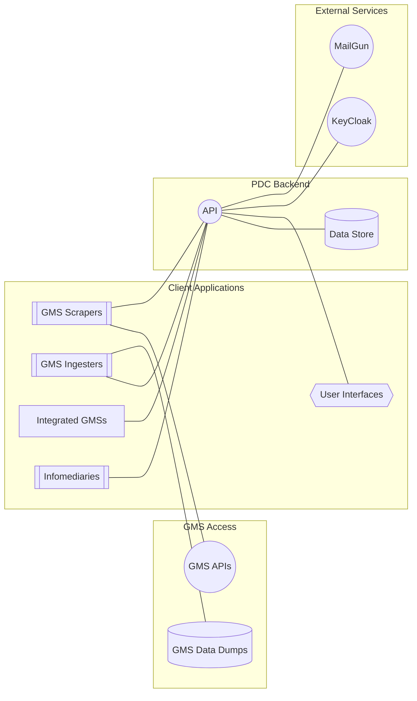

# Architecture

## Diagram

(This diagram is generated by [mermaid](https://mermaid-js.github.io/mermaid/#/./flowchart?id=flowcharts-basic-syntax))

## Concepts

The core of the PDC is its API. All third party integrations and user interfaces are powered by that API.

- `GMS Scrapers` pull data from a GMS api on a regular basis and inject that data into the PDC.
- `GMS Ingesters` are provided data by a GMS (e.g. in the form of batch exports) and inject that data into the PDC.
- `Integrated GMSs` are GMSs that know how to inject data into the PDC directly.
- `Infomediaries` are third party information sources, and might be scraped / ingested (TBD based on what we learn).
