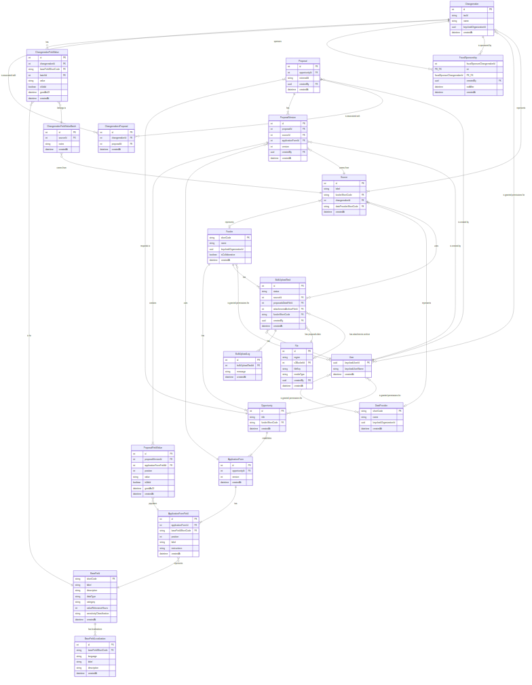

# PDC Schema

## Entity Relationship Diagram


## Narrative

1. A `Changemaker` is associated with a `Proposal` (via `ChangemakersProposal`).
2. A `Proposal` is a response to an `Opportunity`. An `Opportunity` represents a given challenge, RFP, etc.
3. An `Opportunity` establishes an `Application Form`. An application form is the set of fields that make up an application. An `Opportunity` might update its `Application Form` over time, which is why an `Opportunity` can have many `Application Forms`.
4. An `Application Form` will define many `Application Form Fields`.
5. An `Application Form Field` represents a `Base Field`.

Meanwhile...

6. A `Proposal` can have more than one `Proposal Version`. This occurs as a proposal is updated or revised.
7. A `Proposal Version` contains a set of `Proposal Field Values`. These are the responses that were provided for the proposal.
8. A `Proposal Field Value` contains a response to a given `Application Form Field`. Some fields might allow multiple responses, which is why we provide a `position`.

Additionally...

9. A `Changemaker` can have `Changemaker Field Values` that store field data directly associated with the changemaker (independent of any proposal).
10. `Changemaker Field Values` are grouped into `Changemaker Field Value Batches`, each of which comes from a `Source`.
11. `Changemakers` can have `Fiscal Sponsorship` relationships with other `Changemakers`.

The thinking is that when a new proposal is being written, a Grant Management System could ask the PDC "is there any pre-populated data we should use for this changemaker?"

PDC would then:

- Collect the most recent ProposalFieldValues for each BaseField for that Changemaker.
- Collect the most recent ChangemakerFieldValues for each BaseField for that Changemaker.

It would use the ProposalFieldValue set as the primary source, and the ChangemakerFieldValue set as a secondary source.

## Examples

### Registering an Application Form


New `Application Forms` will have to be externally defined; some day maybe we will make a user interface that generates an `Application Form` definition, but for the short term this will be manually written JSON (or YAML, or something else highly structured). The form will define the full set of `Application Form Fields` along with the shortCode of the `Base Field` to which the `Application Form Fields` map.

This might look something like this:

```
{
  "fields": [
    {
      "name": "Changemaker Name",
      "type": "string",
      "baseFieldShortCode": "changemaker_name",
    },
    {
      "name": "Have you ever seen the Mona Lisa?",
      "type": "boolean",
      "baseFieldShortCode": "mona_lisa_experience",
    }
  ]
}
```

The PDC API would then ingest that new form document. It would first register any `Base Fields` that did not already exist. It would then register the `Application Form` and `Application Form Fields`, with field-level associations to the `Base Fields`.

The database does not differentiate between "core" and "custom" fields. Rather, there will be a set of `Base Fields` that are used by varying numbers of `Application Forms`. We will likely see that some `Base Fields` are used more often than others, and some are only used by a single `Application Form`. We might choose a subset of the `Base Fields` to highlight in our documentation and might call those "core" fields; that decision is not directly relevant to the form.

### Pre-filling an Application


When a changemaker begins to fill out a proposal, the Grant Management System would request all field values known for that `Changemaker`. Which values are returned could be based on business logic; it could be the complete set; it could be restricted to just the fields associated with a given application form -- these would be implementation details but the form would support any of them.

The API would use the Database to collect values associated with past applications (`Proposal Field Values`); these have been directly entered by a changemaker representative.
The API would use the Database to also collect values associated with external / independent sources (`Changemaker Field Values`).

Which values are ultimately selected for prepopulation is an implementation detail. It could be that we decide that ALL distinct values should be returned, and the GMS should determine whether to render a "dropdown" the user could select from. It could be we decide that only the most recently updated values should be returned. It could be we decide that values associated with past proposals should override externally sourced values. Again, these would be implementation decisions but the form would support any of them.

### Submitting a Proposal


The above flow is based on an assumption that we know this is the first time the changemaker had submitted a proposal / it is not an update to an existing proposal.

The API would create a new Proposal, a new Proposal Version, and then it would store one `Proposal Field Value` per `Base Field`. Those field values would then be incorporated in future lookups according to the "Pre-filling a Proposal" logic.

The API might then send alerts to other GMSs depending on business logic, but that is an implementation detail and outside of the scope of this particular example.
