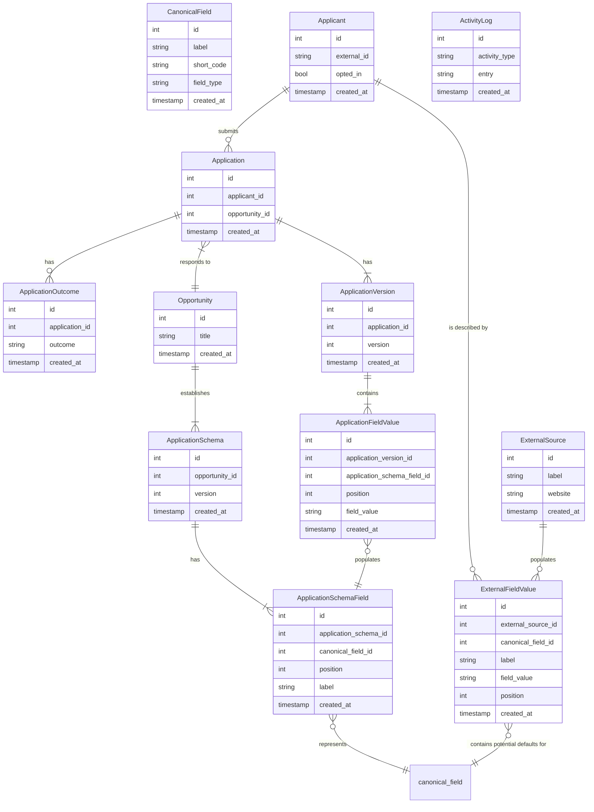
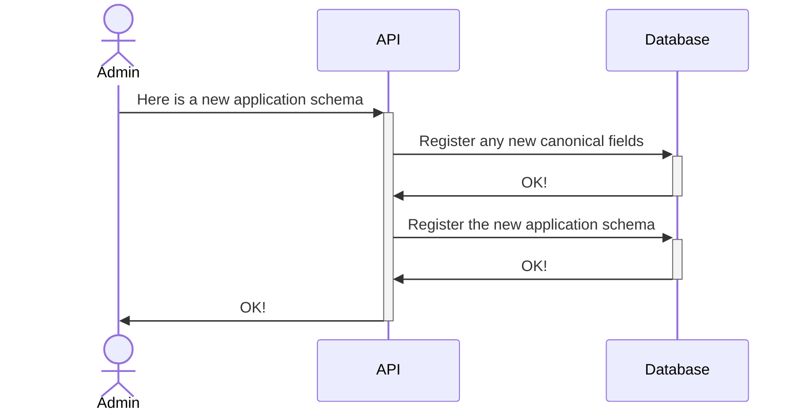
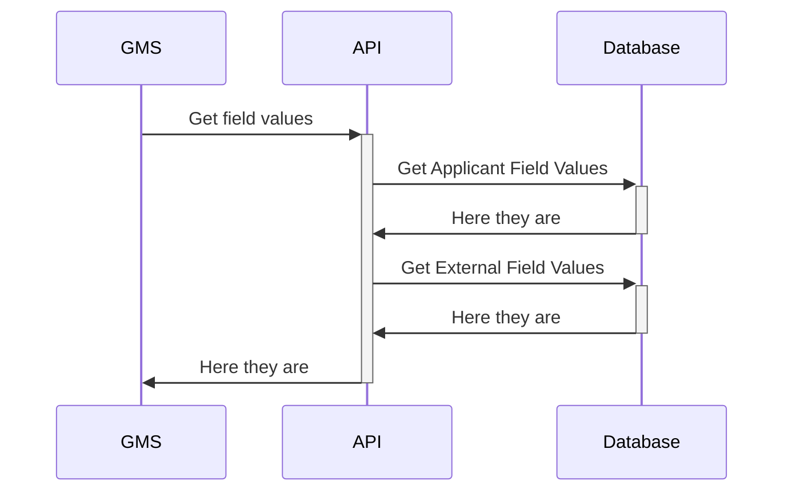
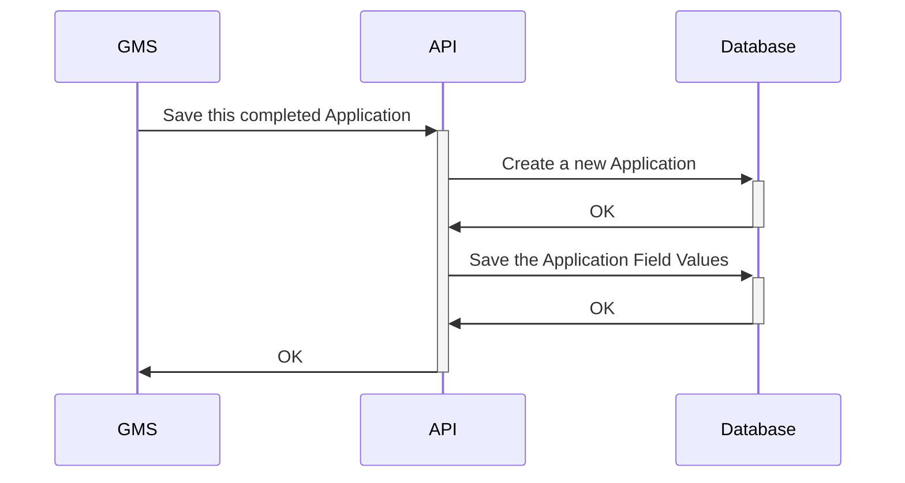

# PDC Schema
## Entity Relationship Diagram



## Narrative

1. An `Applicant` submits an `Application`
2. An `Application` is a response to an `Opportunity`.  An `Opportunity` represents a given challenge, RFP, etc.
3. An `Opportunity` establishes an `Application Schema`. An application schema is the set of fields that make up an application.  An `Opportunity` might update its `Application Schema` over time, which is why an `Opportunity` can have many `Application Schemas`.
4. An `Application Schema` will define many `Application Schema Fields`.
5. An `Application Schema Field` represents a `Canonical Field`.

Meanwhile...

6. An `Application` can have more than one `Application Version`.  This occurs as an application is updated or revised.
7. An `Application Version` contains a set of `Application Field Values`.  These are the responses that were provided by the `Applicant`.
8. An `Application Field Value` contains a response to a given `Application Schema Field`.  Some fields might allow multiple responses, which is why we provide an `index`.

The thinking is that when a new application is being written, a Grant Management System could ask the PDC "is there any pre-populated data we should use for this organization?"

PDC would then:

* Collect the most recent ApplicationFieldValues for each CanonicalField for that Applicant.
* Collect the most recent ExternalFieldValues for each CanonicalField for that Applicant.

It would use the ApplicationFieldValue set as the primary source, and the ExternalFieldValue set as a secondary source.

## Examples
### Registering an Application Schema



New `Application Schemas` will have to be externally defined; some day maybe we will make a user interface that generates an `Application Schema` definition, but for the short term this will be manually written JSON (or YAML, or something else highly structured).  The schema will define the full set of `Application Schema Fields` along with the name of the `Canonical Field` to which the `Application Schema Fields` map.

This might look something like this:

```
{
  "fields": [
    {
      "name": "Applicant Name",
      "type": "string",
      "canonicalField": "applicantName",
    },
    {
      "name": "Have you ever seen the Mona Lisa?",
      "type": "boolean",
      "canonicalField": "haveSeenMonaLisa",
    }
  ]
}
```

The PDC API would then ingest that new schema document.  It would first register any `Canonical Fields` that did not already exist.  It would then register the `Application Schema` and `Application Schema Fields`, with field-level associations to the `Canonical Fields`.

The database does not differentiate between "core" and "custom" fields.  Rather, there will be a set of `Canonical Fields` that are used by varying numbers of `Application Schemas`.  We will likely see that some `Canonical Fields` are used more often than others, and some are only used by a single `Application Schema`.  We might choose a subset of the `Canonical Fields` to highlight in our documentation and might call those "core" fields; that decision is not directly relevant to the schema.

### Pre-filling an Application



When an applicant begins to fills out an application, the Grant Management System would request all field values known for that `Applicant`.  Which values are returned could be based on business logic; it could be the complete set; it could be restricted to just the fields associated with a given application schema -- these would be implementation details but the schema would support any of them.

The API would use the Database to collect values associated with past applications (`Application Field Values`); these have been directly entered by an applicant representative.
The API would use the Database to also collect values associated with external / independent sources (`External Field Values`).

Which values are ultimately selected for prepopulation is an implementation detail.  It could be that we decide that ALL distinct values should be returned, and the GMS should determine whether to render a "dropdown" the user could select from.  It could be we decide that only the most recently updated values should be returned.  It could be we decide that values associated with past applications should override externally sourced values.  Again, these would be implementation decisions but the schema would support any of them.

### Submitting an Application



The above flow is based on an assumption that we know this is the first time the applicant had submitted an application / it is not an update to an existing application.

The API would create a new Application, a new Application Version, and then it would store one `Application Field Value` per `Canonical Field`.  Those field values would then be incorporated in future lookups according to the "Pre-filling an Application" logic.

The API might then send alerts to other GMSs depending on business logic, but that is an implementation detail and outside of the scope of this particular example.
