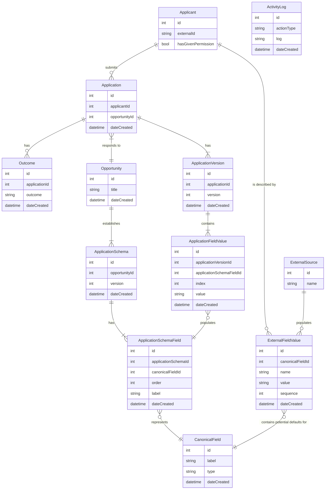

# PDC Schema
## Entity Relationship Diagram

## Narrative

1. An `Applicant` submits an `Application`
2. An `Application` is a response to an `Opportunity`.  An `Opportunity` represents a given challenge, RFP, etc.
3. An `Opportunity` establishes an `Application Schema`. An application schema is the set of fields that make up an application.  An `Opportunity` might update its `Application Schema` over time, which is why an `Opportunity` can have many `Application Schemas`.
4. An `Application Schema` will define many `Application Schema Fields`.
5. An `Application Schema Field` represents a `Canonical Field`.

Meanwhile...

6. An `Application` can have more than one `Application Version`.  This occurs as an application is updated or revised.
7. An `Application Version` contains a set of `Application Field Values`.  These are the responses that were provided by the `Applicant`.
8. An `Application Field Value` contains a response to a given `Application Schema Field`.  Some fields might allow multiple responses, which is why we provide an `index`.

The thinking is that when a new application is being written, a Grant Management System could ask the PDC "is there any pre-populated data we should use for this organization?"

PDC would then:

* Collect the most recent ApplicationFieldValues for each CanonicalField for that Applicant.
* Collect the most recent ExternalFieldValues for each CanonicalField for that Applicant.

It would use the ApplicationFieldValue set as the primary source, and the ExternalFieldValue set as a secondary source.
