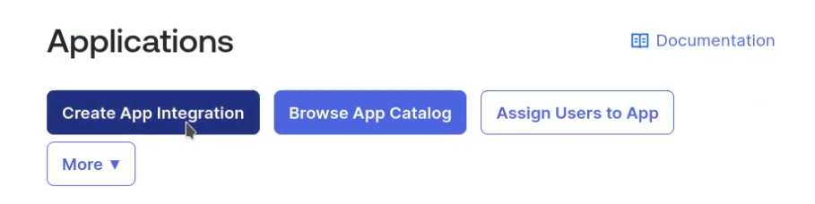
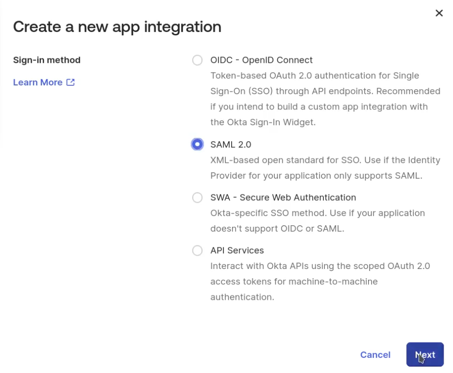
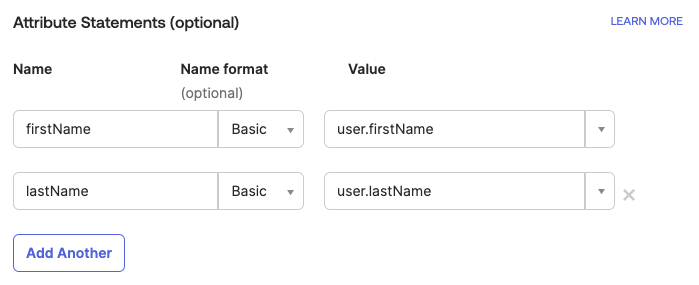
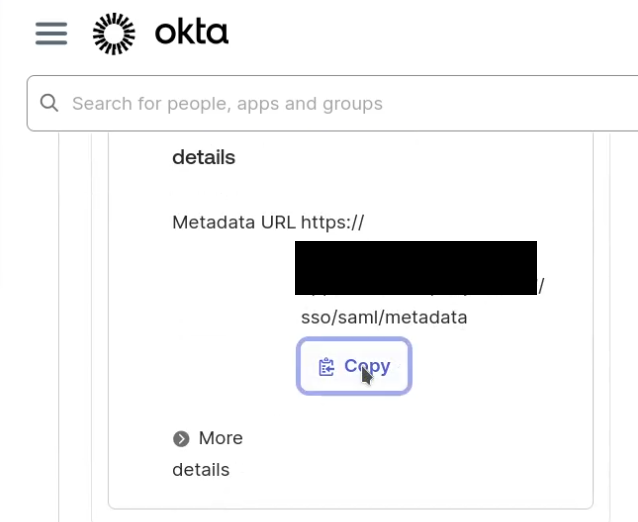

# Organization Identity Provider Integration

The PDC uses Keycloak as an Identity Provider (IdP) and/or Service Provider.

Organizations such as funders, data providers, and changemakers that have their
own IdP can integrate with PDC using their own IdP for authentication while PDC
Keycloak and PDC handle authorization within PDC.

This guide lists specific steps to integrate specific IdPs with PDC Keycloak.

Integration requires a kind of three-way handshake between an organization admin
and a PDC admin before a user can log into PDC:

1. The organization admin configures a PDC app integration and sends information
   to the PDC admin
2. The PDC admin adds an organization integration and sends information to the
   organization admin
3. The organization admin finishes the PDC app integration.

Perform the steps during a live meeting between admins when practical.

For organizations without their own IdP, the PDC administrators can either
manage a Keycloak organization on their behalf (for smaller organizations) or
add a separate realm as an "external" IdP (for larger organizations). In the
latter case, the integration should be configured to allow an organization
member to manage user membership in that realm as if it were the organization's
own IdP. With a separate realm, the users will be "unmanaged" in the new realm
and "managed" in the `pdc` realm. As of this writing, these two options are
available in lieu of a future Keycloak release that includes Fine-Grained Admin
Permissions (FGAP) for the Keycloak organizations capability. When FGAP is
available for Keycloak organizations, the organization in the `pdc` realm should
be configured to allow an organization member to administer its organization,
and this should obsolete the first two options above.

## To Test an Integration

After creating an integration (below), test it using the following steps.

0. Make sure that the user is assigned to PDC within the external IdP
1. Visit the API docs
2. Click "Authorize"
3. Click "Authorize" on the "Available authorizations" modal
4. Enter an email address with the organization's domain
5. Verify that the browser is redirected to the correct IdP (outside PDC)
6. Authenticate (log in)
7. Verify that a redirect back (through Keycloak) to the PDC API docs occurs
8. Try an API call

## External Okta Identity Providers

Before integrating, the PDC team needs to name an identifying alias for each
integrated system, for example `foundation-okta-oidc` or `foundation-okta-saml`,
to be used to link PDC Keycloak with the external IdP.

### Okta Configuration using OIDC (preferred over SAML)

Log in to the admin area to Start an OIDC App Integration (these steps follow
https://help.okta.com/en-us/content/topics/apps/apps_app_integration_wizard_oidc.htm
with the insertion of group steps and appendage of access policy steps).

#### Create a PDC Group

1. On the left nav bar, visit "Directory" -> "Groups"
2. Click "Add group"
3. Set "Name" to `PDC`
4. Set "Description" to `Users who may access the Philanthropy Data Commons`
5. Click "Save"
6. Click the newly created "PDC" group
7. Click "Assign people" and add at least one user.

#### Create a PDC Application

1. On the left nav bar, visit "Applications" -> "Applications"
2. Click "Create App Integration"

   

3. Click "OIDC"
4. Select "Web Application"
5. Click "Next"
6. Add "App Name" of `Philanthropy Data Commons`
7. Leave "Proof of possession" unchecked
8. Set "Grant type" to `Authorization code` only
9. Set "Sign-in redirect URI" to the endpoint provided by the PDC team, similar
   to `https://example.org/realms/pdc/broker/foundation-okta-oidc/endpoint`
   **Important**: the name following `broker/` here needs to match the agreed
   alias mentioned above
10. Clear the "Sign-out redirect URIs" by clicking the X
11. Under "Assignments" select `Limit access to selected groups`
12. Set the "Selected group(s)" to the `PDC` group created earlier
13. Click "Save"
14. Confirm under "Login" that "Login initiated by" is `App Only`
15. Share the "Client ID" from "Client Credentials" with the PDC team
16. Under "Client Credentials" click "Edit"
17. Set "Client authentication" to `Public key / Private key`
18. Check "Require PKCE as additional verification"
19. Under "Public Keys" -> "Configuration", check "Use a URL to fetch keys..."
20. Set the URL to the JWKS URL of the PDC Keycloak server, provided by the PDC
    team, similar to
    `https://example.org/realms/pdc/protocol/openid-connect/certs`
21. Click "Save"
22. Click "Save" at an "Existing client secrets will no longer be used" warning.

#### Create an Access Policy and Rule for the Authorization Server

1. On the left nav bar, visit "Security" -> "API" (way down there)
2. Click the desired Authorization Server name, usually "default"
3. Copy the "Metadata URI" value and send it to the PDC team
4. Click the "Access Policies" tab
5. Click "Add New Access Policy"
6. Set "Name" to `PDC`
7. Set "Description" to `Allow users to authenticate to PDC`
8. Set "Assign to" to `The following clients:`
9. Type `P` in the input box and then pick the "PDC" client created above
10. Click "Create Policy"
11. Under the new PDC policy, click "Add rule"
12. Set the "Rule Name" to `Issue tokens to users authenticating to PDC`
13. Reduce the token lifetimes such as to `5 minutes` (access) and `90 minutes`
14. Click "Create rule".

### Okta Configuration using SAML 2.0

#### Save the current PDC keys in a PEM file

1. Visit the PDC Keycloak SAML configuration URL, similar to
   `https://example.org/realms/pdc/protocol/saml/descriptor`
2. Within the XML document presented, copy and paste each PEM-encoded value
   under "<md:KeyDescriptor use='signing'>...<ds:X509Certificate>", similar to
   `MIIC...=`, into a single (new) text file.
3. Surround each of the values from above with PEM headers and footers, namely
   `-----BEGIN CERTIFICATE-----` and `-----END CERTIFICATE-----`, each on their
   own lines.
4. Line-wrap each of the values from above at 64 characters, according to
   https://www.rfc-editor.org/rfc/rfc7468.html#page-5
5. Save the new file with a `.crt` extension, such as `pdc_signing_keys.crt`.

This file will be used below to configure signature validation. When using SAML
with Okta, there is no option to dynamically fetch these keys. So when PDC keys
are updated, the integration will not work until re-uploading the PDC keys. Thus
[OIDC is preferred](#Okta Configuration using OIDC (preferred over SAML)) when
using Okta.

#### Configure Okta App Integration

1. Log in to the admin area to Start a SAML App Integration (these steps follow
   https://help.okta.com/en-us/content/topics/apps/apps_app_integration_wizard_saml.htm
   )
2. On the left nav bar, visit "Applications" -> "Applications"
3. Click "Create App Integration"

   

4. Click "SAML 2.0"

   

5. Click "Next"
6. Set "App Name" to `Philanthropy Data Commons`
7. If you wish to add a logo, one may be found on the [PDC website](https://philanthropydatacommons.org/)
8. Check "Do not display application icon to users" under "App visibility" to
   avoid erroneous IdP-initiated login attempts (because users begin the login
   flow from PDC Apps and not from the Okta IdP)
9. Click "Next"
10. Paste the Single sign-on URL endpoint provided by the PDC team, similar to
    `https://example.org/realms/pdc/broker/foundation-okta-saml/endpoint`
    into Okta's "Single sign-on URL"
11. Paste the "SP Entity ID URL" provided by the PDC team, similar to
    `https://example.org/realms/pdc` into Okta's "Audience URI (SP Entity ID)"
    field
12. Set the "Name ID format" to `EmailAddress`
13. Set the "Application username" to `Email`
14. Expand "Show Advanced Settings"
15. Ensure both "Response" and "Assertion Signature" are `Signed`
16. Add a "Signature Certificate" PEM file by clicking "Browse files...",
    created [above](#Save the current PDC keys in a PEM file)
17. Add Attribute Statements (case sensitive, use the dropdown for each Value):
    - Map `firstName`, `Basic` to `user.firstName`
    - Map `lastName`, `Basic` to `user.lastName`

    

18. Click "Next"
19. Click "Finish"
20. Send Okta's SAML "Metadata URL" value to the PDC team.

    

The PDC team will use this URL to configure an Identity Provider (IdP) within
PDC Keycloak and link it to a PDC Keycloak organization such that when users log
into PDC they will be redirected to their canonical IdP based on the domain name
in the email address. For example, entering "user@myfoundation.org" should
redirect the user to Okta. [Okta
configuration](https://help.okta.com/en-us/content/topics/users-groups-profiles/usgp-assign-apps.htm)
will determine whether a myfoundation user can log into the PDC. If
"user@myfoundation.org" has been assigned in Okta, then the Okta-configured
login procedure will be used for authentication, and if successful, the user
will be redirected to PDC Keycloak and be granted a valid PDC session.

## Google Workspace Configuration using SAML 2.0

As of this writing, Google Workspace seems to support SAML 2.0 and not OIDC.

### In Google Workspace

Via https://support.google.com/a/answer/6087519?sjid=14379173059534913826-NA#zippy=%2Cstep-add-the-custom-saml-app

1. Visit https://admin.google.com and log in as a super-administrator user.
2. Visit https://admin.google.com/ac/apps/unified
3. Click "Add App" -> "Add custom SAML app"
4. Set "App name" to `Philanthropy Data Commons`
5. Set "Description" to `Allows login to the PDC using this Google Workspace`
6. Set "App icon" to the PDC logo
7. Click "Continue"
8. Click "DOWNLOAD METADATA" and save the XML file
9. Click "Continue"

Send the metadata XML file to the person helping with integration.

### In PDC Keycloak

1. Visit the Keycloak admin console
2. In the PDC realm, visit "Identity providers"
3. Click "Add Identity Provider" of type "SAML v2.0." If none are present such
   that "Add Identity Provider" is not available, click "SAML v2.0" under "User
   defined"
4. Set the "Alias" to the descriptive, simple, unique alias named above, e.g.
   `foundation-google-saml`, **Important**: this alias sets the broker or
   "Single Sign-on URL" used by Google for integration and therefore must match
   the "Single Sign-on URL" configured in Google Workspace
5. Set "Use entity descriptor" to "Off"
6. Under "Import config from file" click "Browse"
7. Choose the metadata file downloaded from Google above
8. Ensure "NameID policy format" is set to "Email"
9. Ensure "Principal type" is set to "Subject NameID"
10. Set "Want Assertions signed" to "On"
11. Ensure "Validate signatures" is "On"
12. Set "Pass subject" to "On"
13. Set "Sync mode" to "Import"
14. Click "Save"
15. Visit the new Identity provider's Provider details
16. Write down the "Redirect URI" value and "Service provider entity ID" value
17. Click "Mappers" tab
18. Add a map from `firstName` to `firstName`:
    - Click "Add mapper"
    - Set "Name" to `Import First Name`
    - Leave "Sync mode override" as `Inherit`
    - Select `Attribute Importer` from the "Mapper type" dropdown menu
    - Set "Attribute Name" to `firstName` **Important:** this attribute name
      must match a "Name" set in Google "App attributes" for the import to work
    - Leave "Name Format" as `ATTRIBUTE_FORMAT_BASIC`
    - Select `firstName` from the "User Attribute Name" dropdown
    - Click "Save"
19. Add a map from `lastName` to `lastName`:
    - Click "Add mapper"
    - Set "Name" to `Import Last Name`
    - Leave "Sync mode override" as `Inherit`
    - Select `Attribute Importer` from the "Mapper type" dropdown menu
    - Set "Attribute Name" to `lastName` **Important:** this attribute name must
      match a "Name" set in Google "App attributes" for the import to work
    - Leave "Name Format" as `ATTRIBUTE_FORMAT_BASIC`
    - Select `lastName` from the "User Attribute Name" dropdown
    - Click "Save".

Send the following information to the organization integrating Google:

- PDC Keycloak's "Redirect URI" (to be Google's "ACS URL")
- PDC Keycloak's "Service provider entity ID" (to be Google's "Entity ID")

Link the newly added IdP to its corresponding organization.

See also this Keycloak documentation:
https://www.keycloak.org/docs/26.2.5/server_admin/index.html#_managing_identity_provider_

1. Visit "Organizations"
2. Open the organization
3. Click the "Identity Providers" tab
4. Click "Link identity provider"
5. Select the IdP (created above) from the "Identity provider" dropdown menu
6. Select the organization's domain name from the "Domain" dropdown menu
7. Keep "Hide on login page" set to `On`
8. Set "Redirect when email domain matches" to `On`
9. Click "Save".

### In Google Workspace Again

1. Enter Keycloak's "Redirect URI" as Google's "ACS URL"
2. Enter Keycloak's "Service provider entity ID" as Google's "Entity ID"
3. Ensure "Signed response" is unchecked (assertions will still be signed)
4. Set "Name ID format" to `Email`
5. Set "Name ID" to `Basic Information > Primary email`
6. Click "Continue"
7. Under Attributes, click "Add Mapping"
8. Select "First name", set "App attributes" to `firstName` **Important:** this
   attribute name must match an "Attribute Name" set in Keycloak Mappers for the
   import to work.
9. Click "Add Mapping" again
10. Select "Last name", set "App attributes" to `lastName` **Important:** this
    attribute name must match an "Attribute Name" set in Keycloak Mappers for
    the import to work.
11. Click "Finish"

By default, User access is "OFF for everyone" so create a group for PDC access.

1. Click "Directory" on the leftmost menu
2. Click "Groups"
3. Click "Create group" or "CREATE A GROUP"
4. Set "Group name" to "PDC"
5. Set "Group email" to "pdc"
6. Set "Group description" to "Philanthropy Data Commons users"
7. Check "Security" to make it a security group to which you apply policies
8. Click "Next"
9. Set "Access type" to "Restricted"
10. Click "CREATE GROUP"

Add at least one member to the newly created PDC group.

1. From the PDC group, click "ADD MEMBERS"
2. Find and add a user by clicking "ADD TO GROUP"

Grant members of the PDC group access to log in to the PDC App.

1. Visit the ["Apps" area](https://admin.google.com/ac/apps/unified?journey=218)
2. Click the "Philanthropy Data Commons" app
3. Under "User access" click the inverted carat to expand "User access"
4. Under "Philanthropy Data Commons" click "Groups"
5. Click "Search for a group"
6. Click the "PDC" group
7. Under "Service status" click "ON"
8. Click "SAVE"
9. Visit the "Philanthropy Data Commons" app again
10. Verify that "User access" is "ON for 1 group", namely the "PDC" group

## Microsoft Entra Configuration Using Built-in Microsoft Provider

Following https://www.keycloak.org/docs/26.5.2/server_admin/index.html#_microsoft

### In Microsoft Entra

From https://entra.microsoft.com/ perform the following steps.

1. Copy or save the Tenant ID
2. Visit "App registrations"
3. Click "New registration"
4. Set "Name" to `Philanthropy Data Commons`
5. Set "Who can use this application or access this API?" to "Accounts in this
   organizational directory only (Default Directory only - Single tenant)"
6. Click "Register"
7. Click "Certificates & secrets"
8. Under "Client secrets" click "New client secret"
9. Set "Description" to `PDC delegated authentication`
10. Set "Expires" to "730 days (24 months)"
11. Click "Add"
12. Copy or save the secret Value and Secret ID
13. Send Tenant ID, Application (client) ID, and secret Value to the PDC admin

Grant permission to PDC Keycloak to read user data from Microsoft.

1. Under "Manage" click "API Permissions"
2. Under "Microsoft Graph" to the right of "User.Read" click the ellipsis "..."
3. Under "Configured Permissions" click "Add a permission"
4. Click "Microsoft Graph"
5. Click "Delegated permissions"
6. Check "email", "openid", and "profile"
7. Click "Add permissions"
8. Click "Grant admin consent for Default Directory"

Restrict PDC access to specific users (or groups)

Following https://learn.microsoft.com/en-us/entra/identity-platform/howto-restrict-your-app-to-a-set-of-users

1. Click "Enterprise Apps" in the leftmost menu
2. Click "Philanthropy Data Commons" (this context differs from the above)
3. Under "Manage" click "Properties"
4. Set "Assignment required?" to "Yes"
5. Click "Save" (above the properties)
6. Under "Manage" click "Users and groups"
7. Click "Add user/group"
8. Under "Users" click "None Selected"
9. Check the users that should have access to PDC
10. Click "Select"
11. Click "Assign"

If your subscription permits, you may instead (of steps 8-9) create a PDC group,
assign users to that group, and then assign the group to the App.

### In Keycloak

1. Visit the Keycloak admin console
2. In the PDC realm, visit "Identity providers"
3. Click "Add provider"
4. Under "Social", click "Microsoft"
5. Set "Alias" to include the short name of the organization and `client`, for
   example `myfoundation-microsoft-entra-client`
6. Set the display name to include the full name of the organization, for
   example `My Foundation Microsoft Entra Client`
7. Set the "Client ID" to the value provided by the Entra admin (a UUID)
8. Set the "Client Secret" to the value provided by the Entra admin
9. Set "Prompt" to `login`
10. Set Tenant ID to the value provided by the Entra admin (a UUID)
11. Click "Add"

Under the newly created Identity provider,

1. Set "Scopes" to `openid profile email`
2. Set "Hide on login page" to "On"
3. Set "Show in Account console" to "When linked"
4. Set "Sync mode" to "Import"
5. Click "Save"
6. Copy or save the "Redirect URI" value
7. Send the Redirect URI to the Entra admin

Link the Organization to the newly created Identity provider:

1. Visit "Organizations"
2. Open the organization
3. Click the "Identity Providers" tab
4. Click "Link identity provider"
5. Select the IdP (created above) from the "Identity provider" dropdown menu
6. Select the organization's domain name from the "Domain" dropdown menu
7. Keep "Hide on login page" set to `On`
8. Set "Redirect when email domain matches" to `On`
9. Click "Save".

### In Microsoft Entra again

1. Visit "App registrations"
2. Click the "All applications" tab
3. Click "Philanthropy Data Commons"
4. Under "Redirect URIs" click "Add a Redirect URI"
5. Click "Add Redirect URI"
6. Click "Web"
7. Set "Redirect URI" to the value sent by the PDC admin
8. Ensure the "Implicit grant and hybrid flows" items are unchecked
9. Click "Configure"

## Keycloak Configuration

Configure the PDC realm to use organizations and set up an organization.

See also this Keycloak Documentation:
https://www.keycloak.org/docs/26.2.5/server_admin/index.html#_managing_organizations

1. In the PDC realm, go to "Realm Settings"
2. Set "Organizations" to `On` (if not already enabled)
3. Set "Admin Permissions" to `On`
4. Click "Save"
5. Visit "Organizations"
6. Click "Create Organization" (if not already present):
   - Set "Name" to the long name of the organization, e.g. `My Foundation`
   - Set "Alias" to a short name of the organization, e.g. `myfoundation`
   - Set "Domain" to the organization's domain name, e.g. `myfoundation.org`
   - Optionally set "Redirect URL" to the API documentation URL
7. Click "Save".

### PDC Keycloak Configuration with Okta via OIDC (preferred over SAML)

Add an OIDC Identity Provider to the PDC Realm.

See also this Keycloak documentation:
https://www.keycloak.org/docs/26.2.5/server_admin/index.html#_identity_broker_oidc

1. Visit "Identity Providers"
2. Click "Add Provider" of type "OpenID Connect v1.0." If no existing providers
   are present such that "Add Identity Provider" is not available, click "OpenID
   Connect v1.0" under "User defined"
3. Set the "Alias" to the descriptive, simple, unique alias named above, e.g.
   `foundation-okta-oidc`, **Important**: this alias sets the broker or
   "Single Sign-on URL" used by Okta for integration and therefore must match
   the "Single Sign-on URL" configured in Okta
4. Set the "Display name" to describe the organization that is herein linked
5. Under "OpenID Connect Settings" leave "Use discover endpoint" `On`
6. Set "Discovery endpoint" to the "Metadata URI" from Okta, similar to
   `https://example.org/oauth2/default/.well-known/oauth-authorization-server`
7. Set "Client authentication" to `JWT signed with private key`
8. Set "Client ID" to the "Client ID" from Okta, similar to
   `0oatc6chn9IXY0389697`
9. Leave "Client Secret" blank (it is not required due to using a keypair)
10. Leave "Client assertion signature algorithm" to `Algorithm not specified`
11. Leave "Client assertion audience" blank
12. Leave "Add X.509 Headers to the JWT" `Off`
13. Click "Add"
14. Under "OpenID Connect Settings", ensure "Validate Signatures" is `On`
15. Set "Use PKCE" to `On`
16. Set "PKCE Method" to `S256`
17. Expand "Advanced"
18. Set "Pass login_hint" to `On`
19. Set "Scopes" to `openid profile email`
20. Set "Trust Email" to `On`
21. Set "Hide on login page" to `On`
22. Set "Sync mode" to `Force`
23. Click "Save"
24. Click the "Mappers" tab
25. Click "Add mapper"
26. Set "Name" to `Import First Name From Profile Claim`
27. Set "Mapper type" to `Attribute Importer` (from the dropdown)
28. Set "Claim" to `profile`
29. Set "User Attribute Name" to `firstName` (from the dropdown)
30. Click "Save"
31. Click "Provider details" near the top to go back to the "Mappers" tab
32. Click "Add mapper"
33. Set "Name" to `Import Last Name From Profile Claim`
34. Set "Mapper type" to `Attribute Importer` (from the dropdown)
35. Set "Claim" to `profile`
36. Set "User Attribute Name" to `lastName` (from the dropdown)
37. Click "Save"
38. Click "Provider details" near the top to go back to the "Mappers" tab
39. Click "Add mapper"
40. Set "Name" to `Import Email Address From Email Claim`
41. Set "Mapper type" to `Attribute Importer` (from the dropdown)
42. Set "Claim" to `email`
43. Set "User Attribute Name" to `email` (from the dropdown)
44. Click "Save".

Link the newly added IdP to its corresponding organization.

See also this Keycloak documentation:
https://www.keycloak.org/docs/26.2.5/server_admin/index.html#_managing_identity_provider_

1. Visit "Organizations"
2. Open the organization
3. Click the "Identity Providers" tab
4. Click "Link identity provider"
5. Select the IdP (created above) from the "Identity provider" dropdown menu
6. Select the organization's domain name from the "Domain" dropdown menu
7. Keep "Hide on login page" set to `On`
8. Set "Redirect when email domain matches" to `On`
9. Click "Save".

Test the integration (see [above](#testing-an-okta-integration)).

### PDC Keycloak Configuration with Okta via SAML 2.0

Add a SAML Identity Provider to the PDC Realm.

See also this Keycloak documentation:
https://www.keycloak.org/docs/26.2.5/server_admin/index.html#_client-saml-configuration

1. Visit "Identity Providers"
2. Click "Add Identity Provider" of type "SAML v2.0." If none are present such
   that "Add Identity Provider" is not available, click "SAML v2.0" under "User
   defined"
3. Set the "Alias" to the descriptive, simple, unique alias named above, e.g.
   `foundation-okta-saml`, **Important**: this alias sets the broker or
   "Single Sign-on URL" used by Okta for integration and therefore must match
   the "Single Sign-on URL" configured in Okta
4. Set the "SAML entity descriptor" to the URL sent from the person who
   configured Okta. In Okta this is called the "Metadata URL"
5. Verify that the "NameID policy format" is `Email` (if not, contact the person
   who configured Okta to correct the Okta configuration, refer to Okta's step 11)
6. Set the "Principal type" to `Subject NameID`
7. Set "Want AuthnRequests signed" to `On`
8. Set "Want Assertions signed" to `On`
9. Set "Validate Signatures" to `On`
10. Set "Sign service provider metadata" to `On`
11. Set "Pass subject" to `On`
12. Set "Hide on login page" to `On`
13. Set "Sync mode" to `Force`
14. Click "Save"
15. Click the "Mappers" tab on the Identity Provider
16. Add a map from `firstName` to `firstName`:
    - Click "Add mapper"
    - Set "Name" to `Import First Name`
    - Leave "Sync mode override" as `Inherit`
    - Select `Attribute Importer` from the "Mapper type" dropdown menu
    - Set "Attribute Name" to `firstName` **Important:** this attribute name
      must match a "Name" set in Okta "Attribute Statements (optional)" for the
      import to work
    - Leave "Name Format" as `ATTRIBUTE_FORMAT_BASIC`
    - Select `firstName` from the "User Attribute Name" dropdown
    - Click "Save"
17. Add a map from `lastName` to `lastName`:
    - Click "Add mapper"
    - Set "Name" to `Import Last Name`
    - Leave "Sync mode override" as `Inherit`
    - Select `Attribute Importer` from the "Mapper type" dropdown menu
    - Set "Attribute Name" to `lastName` **Important:** this attribute name must
      match a "Name" set in Okta "Attribute Statements (optional)" for the
      import to work
    - Leave "Name Format" as `ATTRIBUTE_FORMAT_BASIC`
    - Select `lastName` from the "User Attribute Name" dropdown
    - Click "Save".

Link the newly added IdP to its corresponding organization.

See also this Keycloak documentation:
https://www.keycloak.org/docs/26.2.5/server_admin/index.html#_managing_identity_provider_

1. Visit "Organizations"
2. Open the organization
3. Click the "Identity Providers" tab
4. Click "Link identity provider"
5. Select the IdP (created above) from the "Identity provider" dropdown menu
6. Select the organization's domain name from the "Domain" dropdown menu
7. Keep "Hide on login page" set to `On`
8. Set "Redirect when email domain matches" to `On`
9. Click "Save".

Test the integration (see [above](#testing-an-okta-integration)).
