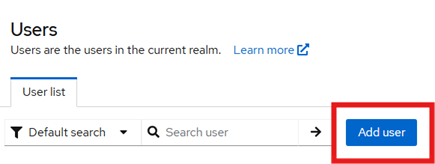
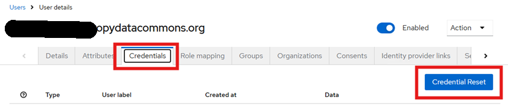
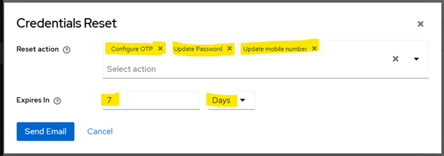

# User Onboarding Checklist

These steps should ensure a good user experience for users that are new to the
PDC. The intended audience is PDC administrators.

## In the PDC Keycloak (PDC Realm)

These steps require membership in the `pdc-admin` group.

Visit https://auth.philanthropydatacommons.org/admin/pdc/console/#/pdc/users

- [ ] Click "Add user"\
       
  - [ ] Enter the user's email address
  - [ ] Enter the user's first and last names
  - [ ] Click "Create"
- [ ] Click the "Credentials" tab on the newly created user
  - [ ] Click "Credential Reset"\
         
  - [ ] Add the following "Reset action"s:
    - [ ] Configure OTP
    - [ ] Update Password
    - [ ] Update mobile number
  - [ ] Adjust the Expiration to give the user enough time to login (usually 7-14 days)\
         
  - [ ] Click "Send Email"
- [ ] Ask the user to click the link from the email
- [ ] Provide the user with the following link to Exchange: https://exchange.philanthropydatacommons.org

## Add an organization if needed

Do [organization onboarding](./ORGANIZATION_ONBOARDING_CHECKLIST.md) as needed.

## In the PDC Keycloak (Keycloak Realm)

Join the newly created user to an organization.

These steps require PDC realm administrative access (from the Keycloak realm).

Use https://auth.philanthropydatacommons.org/admin/master/console/#/pdc/ here.

- [ ] Click "Organizations"
- [ ] Click on the new user's organization
- [ ] Click "Members"
- [ ] Click "Add member"
- [ ] Click "Add realm user"
  - [ ] Check the new user
  - [ ] Click "Add"
