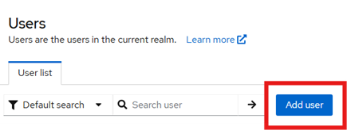
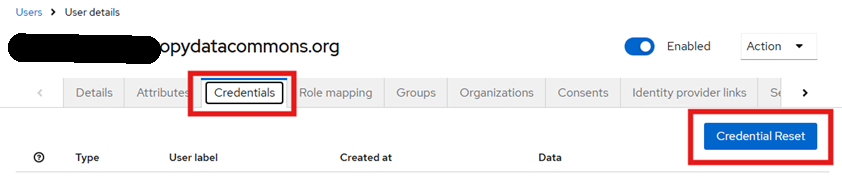
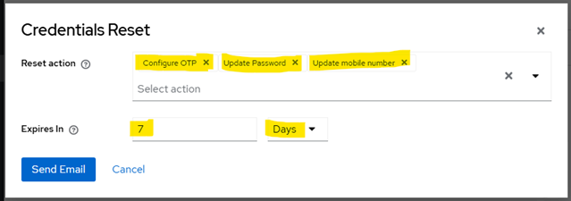

# User Onboarding Checklist

These steps should ensure a good user experience for users that are new to the
PDC. The intended audience is PDC administrators. These steps apply to users
that do not belong to an organization with an authentication system (IdP)
integrated with the PDC Keycloak.

## Add a user

Visit https://auth.philanthropydatacommons.org/admin/pdc/console/#/pdc/users

- [ ] Click "Add user"\
      
  - [ ] Enter the user's email address
  - [ ] Enter the user's first and last names
  - [ ] Click "Create"
- [ ] Click the "Credentials" tab on the newly created user
  - [ ] Click "Credential Reset"\
        
  - [ ] Add the following "Reset action"s:
    - [ ] Configure OTP
    - [ ] Update Password
    - [ ] Update mobile number
  - [ ] Adjust the Expiration to give the user enough time to login (usually 7-14 days)
        
  - [ ] Click "Send Email"
- [ ] Ask the user to click the link from the email
- [ ] Provide the user with the following link to Exchange: https://exchange.philanthropydatacommons.org

## Add an organization if needed

Do [organization onboarding](./ORGANIZATION_ONBOARDING_CHECKLIST.md) as needed.

Join the newly created user to an organization.

Visit https://auth.philanthropydatacommons.org/admin/pdc/console/#/pdc/organizations

- [ ] Click "Organizations"
- [ ] Click on the new user's organization
- [ ] Click "Members"
- [ ] Click "Add member"
- [ ] Click "Add realm user"
  - [ ] Check the new user
  - [ ] Click "Add"
